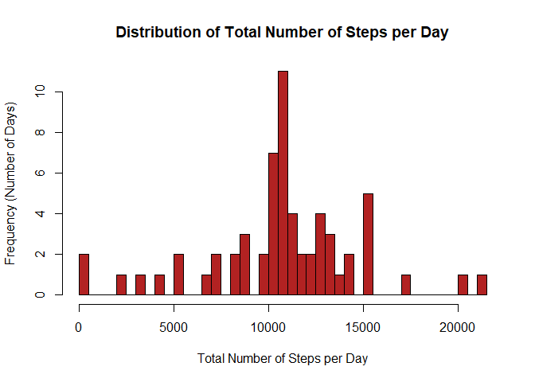

# Reproducible Research: Peer Assessment 1 by Somprabh Jha
## Background
This assignment makes use of data from a personal activity monitoring
device. This device collects data at 5 minute intervals through out the
day. The data consists of two months of data from an anonymous
individual collected during the months of October and November, 2012
and include the number of steps taken in 5 minute intervals each day.


## Data
The data for this assignment can be downloaded from the course web site:

* Dataset: [Activity monitoring data](https://d396qusza40orc.cloudfront.net/repdata%2Fdata%2Factivity.zip) [52K]

The variables included in this dataset are:

* **steps**: Number of steps taking in a 5-minute interval (missing values are
    coded as `NA`).

* **date**: The date on which the measurement was taken in YYYY-MM-DD format.

* **interval**: Identifier for the 5-minute interval in which measurement was
    taken.

The dataset is stored in a comma-separated-value (CSV) file and there are a total of 17,568 observations in this dataset.


## Loading and preprocessing the data
1. Load the required packages.

```r
library(knitr)
```

```
## Warning: package 'knitr' was built under R version 3.4.1
```

```r
library(dplyr)
```

```
## Warning: package 'dplyr' was built under R version 3.4.1
```

```
## 
## Attaching package: 'dplyr'
```

```
## The following objects are masked from 'package:stats':
## 
##     filter, lag
```

```
## The following objects are masked from 'package:base':
## 
##     intersect, setdiff, setequal, union
```

```r
library(ggplot2)
```

```
## Warning: package 'ggplot2' was built under R version 3.4.1
```
2. Set the working directory.

```r
setwd("E:/DataScience/ReproducibleResearch/Week2/Programming-assignment-1/RepData_PeerAssessment1")
```
3. Unzip the downloaded file.

```r
unzip("activity.zip")
```
4. Load the data (i.e. `read.csv()`).

```r
inputdata <- read.csv("activity.csv", header=TRUE, sep=',', na.strings = "NA", colClasses= c(steps="integer", date="Date", interval="integer"))
```
5. Validate if data loaded correctly

```r
str(inputdata)
```

```
## 'data.frame':	17568 obs. of  3 variables:
##  $ steps   : int  NA NA NA NA NA NA NA NA NA NA ...
##  $ date    : Date, format: "2012-10-01" "2012-10-01" ...
##  $ interval: int  0 5 10 15 20 25 30 35 40 45 ...
```
Result should show that records loaded and number of variables match the information from the Data segment of this document.

## What is mean total number of steps taken per day?
1. Prepare data for plotting.

```r
totalstepsperday <- inputdata %>%
                    group_by(date) %>%
                    summarize(totalsteps = sum(steps, na.rm=FALSE))
```
2. Histogram of the total number of steps taken each day.

```r
hist(totalstepsperday$totalsteps, main="Distribution of Total Number of Steps per Day", xlab="Total Number of Steps per Day", ylab="Frequency (Number of Days)",   breaks=50, col="firebrick")
```

<!-- -->

3. Calculate and report the **mean** and **median** total number of steps taken per day.

```r
meansteps <- mean(totalstepsperday$totalsteps, na.rm=TRUE)
mediansteps <- median(totalstepsperday$totalsteps, na.rm=TRUE)
```
    The mean total number of steps taken is 1.0766189\times 10^{4} and the median total number of steps taken is 10765


## What is the average daily activity pattern?
1. Prepare data for plotting.

```r
averagestepsperinterval <- inputdata %>%
                    group_by(interval) %>%
                    summarize(averagesteps = mean(steps, na.rm=TRUE))
```
2. Time series plot (i.e. `type = "l"`) of the 5-minute interval (x-axis) and the average number of steps taken, averaged across all days (y-axis)

```r
plot(averagestepsperinterval$interval, averagestepsperinterval$averagesteps, type = "l", main = "Average Daily Activity", xlab = "Interval", ylab = "Average Number of Steps")
```

<!-- -->

3. Which 5-minute interval, on average across all the days in the dataset, contains the maximum number of steps?

```r
maxstepsintervalrec <- averagestepsperinterval[which.max(averagestepsperinterval$averagesteps),]
maxstepsinterval <- maxstepsintervalrec[1]
```
    The interval with the maximum average steps taken per interval is 835


## Imputing missing values
1. Calculate and report the total number of missing values in the dataset (i.e. the total number of rows with `NA`s).

```r
totalnarows <- sum(is.na(inputdata))
```
    The total numbner of rows with NA's is 2304
    We will use the mean for that 5-minute interval to populate the corresponding NA's in the steps.
3. Create a new dataset that is equal to the original dataset but with the missing data filled in.

```r
newinputdata <- inputdata
nasteps <- is.na(newinputdata$steps)
newinputdatatemp <- tapply(newinputdata$steps, newinputdata$interval, mean, na.rm=TRUE, simplify=TRUE)
newinputdata$steps[nasteps] <- newinputdatatemp[as.character(newinputdata$interval[nasteps])]
```
4. Prepare data for plotting.

```r
newtotalstepsperday <- newinputdata %>%
                       group_by(date) %>%
                       summarize(totalsteps = sum(steps, na.rm=FALSE))
```
5. Histogram of the total number of steps taken each day.

```r
hist(newtotalstepsperday$totalsteps, main="Distribution of Total Number of Steps per Day", xlab="Total Number of Steps per Day", ylab="Frequency (Number of Days)",   breaks=50, col="firebrick")
```

<!-- -->

6. Calculate and report the **mean** and **median** total number of steps taken per day.

```r
newmeansteps <- mean(newtotalstepsperday$totalsteps)
newmediansteps <- median(newtotalstepsperday$totalsteps)
```
    The mean total number of steps taken is 1.0766189\times 10^{4} and the median total number of steps taken is 1.0766189\times 10^{4}
7. Do these values differ from the estimates from the first part of the assignment?  
    Now the mean and the median match one another.
8. What is the impact of imputing missing data on the estimates of the total daily number of steps?  
    Our startegy of imputing missing data, using the mean for that 5-minute interval, minimally affected only the median, bringing it closer to the mean value as now the missing values are populated with values closer to the mean value.


## Are there differences in activity patterns between weekdays and weekends?
1. Create a new factor variable in the dataset with two levels -- "weekday" and "weekend" indicating whether a given date is a weekday or weekend day.

```r
newinputdata <- newinputdata %>%
                mutate(weektype=as.factor(ifelse(weekdays(date) %in%  c("Saturday","Sunday"), "weekend","weekday")))
```

```
## Warning: package 'bindrcpp' was built under R version 3.4.1
```
2. Prepare data for plotting.

```r
newaveragestepsperday <- newinputdata %>%
                         group_by(weektype,interval) %>%
                         summarize(averagesteps = mean(steps))
```
3. Panel plot containing a time series plot (i.e. `type = "l"`) of the 5-minute interval (x-axis) and the average number of steps taken, averaged across all weekday days or weekend days (y-axis).

```r
ggplot(newaveragestepsperday, aes(x=interval, y=averagesteps, color = weektype)) +
  geom_line() +
  facet_wrap(~weektype, ncol = 1, nrow=2)
```

<!-- -->

4. Are there differences in activity patterns between weekdays and weekends?   
    Looking at the plots we can conclude that - People are active earlier during weekday days with the highest intensity at 835 and the activities seem to be spread out during the weekend over the entire day.
